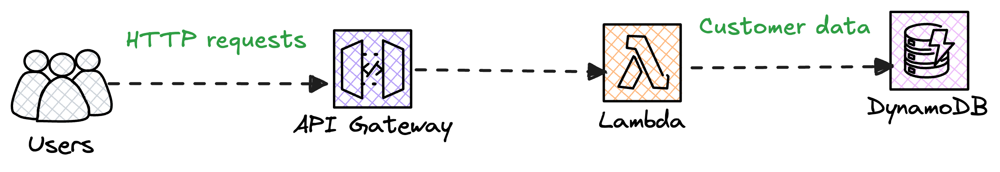

# CustomerManagerService – Cloud Integration Branch
CCustomerManagerService is a Spring Boot-based RESTful API deployed on AWS Lambda via API Gateway, with DynamoDB used for persistence. It is designed to be lightweight, scalable, and testable — and emphasizes custom logic implementation (no built-in sorting), clean modular architecture, and serverless cloud integration.

---
## 🔍 Overview

This service allows creation and retrieval of customer records via a cloud-hosted RESTful API.

### 🔑 Highlights:
- Manual sorted insertion by `lastName`, then `firstName` (without using `.sort()`)
- Data stored in DynamoDB (not file system)
- API deployed as AWS Lambda via SAM
- Robust validation and error handling
- Cloud-friendly: clean logging, portable

---
## 💡 Architecture


- **API Gateway** – Receives HTTP requests
- **AWS Lambda** – Hosts the Spring Boot app
- **DynamoDB** – Persists customer data
- **IAM Role** – Secures Lambda access to DynamoDB

---
## 🔧 Components

* `CustomerController` – REST endpoints
* `CustomerService` – Core business logic, validation
* `CustomerPersistence` – Abstract class (or interface) defining the persistence contract (load() and save())
* `DynamoCustomerPersistence` – Concrete implementation of CustomerPersistence that reads from and writes to DynamoDB
* `GlobalExceptionHandler` – Centralized error handling
* `CustomerApiSimulator` – Simulates POST/GET requests for concurrency and load testing


---
## 🛠 Key Features

- `POST /customers` – Add multiple customers in a single request
- `GET /customers` – Fetch customers, sorted by `lastName`, then `firstName`
- Validation rules:
    - All fields required
    - Age must be ≥ 18
    - IDs must be unique and increasing
- Manually sorted insertion (no `.sort()`)
- AWS Lambda + API Gateway + DynamoDB integration

---
## Deploying to AWS
### 🛠 Prerequisites
Make sure you have:

* AWS CLI installed & configured

* AWS SAM CLI installed

### Build & Deploy
```bash
./mvnw clean package 
```
```bash
sam build
```
```bash
sam deploy --guided
```
This will:

* Package the app

* Upload it to AWS

* Deploy it with API Gateway


---
## 📫 API Endpoints

### 🔹 POST /customers
Adds multiple customers at once.

**Requirements:**
* Must include at least 2 customers

* Each customer must have:

* `firstName`, `lastName` (non-empty)

* age between 10–90

* Sequentially increasing id
```JSON
[
  {
    "firstName": "Leia",
    "lastName": "Ray",
    "age": 25,
    "id": 1
  },
  {
    "firstName": "Frank",
    "lastName": "Anderson",
    "age": 30,
    "id": 2
  }
]
```

### 🔹 GET /customers

Returns the list of all customers, sorted by :
* `lastName`
*  then `firstName`

---
## 📝 Design Decisions & FAQs

* **DynamoDB**: Reliable, scalable, and serverless; avoids need for file persistence

* **Manual sorting**: No built-in sort allowed per spec; custom insertion logic used

* **Serverless via Lambd**a: Minimizes cost, auto-scales, portable
---
## Future Improvements
* Add rate-limiting via API Gateway usage plans

* Add Swagger/OpenAPI spec

* Add GitHub Actions CI/CD pipeline

* Add user authentication (e.g., Cognito)
---
## 📌 Out of Scope
This project intentionally focuses on core functionality and correctness per the take-home specification. The following are considered out of scope for this implementation:

* Lambda cold start mitigation (e.g., provisioned concurrency, warmers)

* Authentication/authorization (e.g., Cognito, JWT, IAM-based auth)

* Multi-tenant or user-scoped storage

* Global scalability optimizations