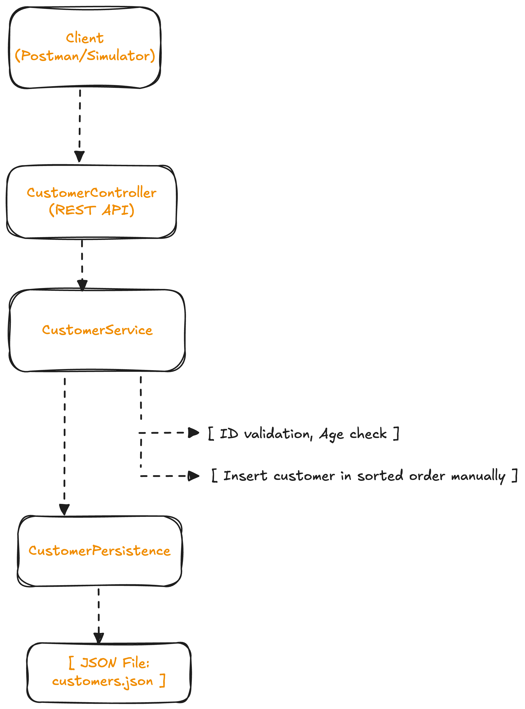

# CustomerManagerService
CustomerManagerService is a Spring Boot-based RESTful API for managing customer records, designed for reliability, scalability, and easy integration.
## 🔍 Overview
This RESTful service allows the creation and retrieval of customer records. The system includes validation, custom sorted insertion (without using built-in sort functions), and file-based persistence to support restarts. Designed with simplicity, portability, and clarity in mind, it is optimized for take-home review scenarios and local execution.

## 💡 Architecture



## 🔧 Components

## Key Features

## Phased Delivery Approach
### ⬆️ Phase 1: Core Functionality (MVP)
* Define model (Customer)
* Implement `/customers` POST and GET
* Manual insertion without `.sort()`
* File-based persistence with Jackson

### ⬆️ Phase 2: Enhancements
* Adding Unit Test and Integration Test
* Structured error handling
* Pagination

## How to Run
### 🛠 Prerequisites
- Java 17+
- Maven 3.8+
- IntelliJ or any Java IDE
### 🏃 Running the App

#### Option 1: From IntelliJ
- Open `CustomerManagerServiceApplication.java`
- Right-click → **Run**

#### Option 2: Using Maven
```bash
./mvnw spring-boot:run
```
#### Option 3: Build & Run the JAR
```bash
./mvnw clean package
java -jar target/CustomerManagerService-0.0.1-SNAPSHOT.jar
```
## 📫 API Endpoints

### 🔹 POST /customers
Adds multiple customers at once.
```JSON
[
  {
    "firstName": "Leia",
    "lastName": "Ray",
    "age": 25,
    "id": 1
  },
  {
    "firstName": "Frank",
    "lastName": "Anderson",
    "age": 30,
    "id": 2
  }
]
```

### 🔹 GET /customers
Returns the list of all customers, sorted by `lastName`, then `firstName`, and then `id`
## 📝 Notes!
